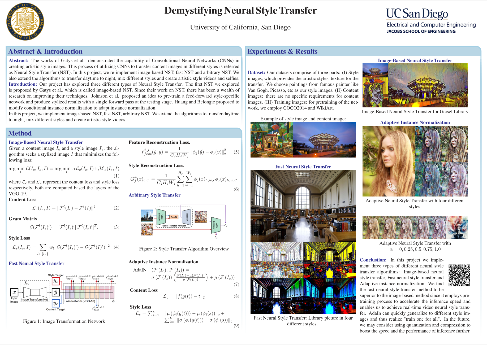
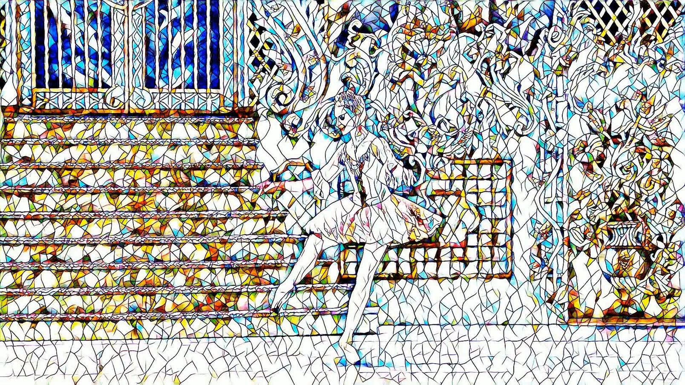

# Neural Style Transfer

This is the final project report of the course ECE228, Spring 2022. We re-implement three papers related to neural style transfer: (1) Image-based neural style transfer (Gatys); (2) Fast neural style transfer; (3) Adaptive instance normalization (AdaIn).  You can find the implementation of each paper in the separate folder. Intructions for running the code is included in each folder.



- [Neural Style Transfer](#neural-style-transfer)
  - [Usage](#usage)
    - [1. Gatys](#1-gatys)
      - [Train](#train)
    - [2. Fast Neural Style Transfer](#2-fast-neural-style-transfer)
      - [Train](#train-1)
      - [Stylize Image](#stylize-image)
      - [Stylize Video](#stylize-video)
      - [Selfie Video](#selfie-video)
    - [3. AdaIn](#3-adain)
      - [Train](#train-2)
      - [Test](#test)
  - [Some results](#some-results)
      - [1. Image-Based Neural Style Transfer](#1-image-based-neural-style-transfer)
      - [2. Fast Neural Style Transfer](#2-fast-neural-style-transfer-1)
      - [3. Adaptive Instance Normalization](#3-adaptive-instance-normalization)
  - [Reference](#reference)


## Usage
Download the following datasets and add them to relative paths:
1. [COCO2014 dataset (13GB)](http://images.cocodataset.org/zips/train2014.zip)
2. [WikiArt](https://www.kaggle.com/c/painter-by-numbers/)
###  1. Gatys

cd into `Gatys` folder, run the following command:

#### Train

```bash
python main.py --content content_starry --style style_vangogh --alpha 1 --beta 1e4 --iter 400 --lr 1 --down True
```

```bash
usage: main.py [--content CONTENT NAME] 
               [--style STYLE NAME]
               [--lr LEARNING RATE] 
               [--iter ITERATION] 
               [--alpha ALPHA] 
               [--beta BETA] 
               [--down DOWNLOAD VGG-19 TO ./models]
```


### 2. Fast Neural Style Transfer

cd into `Fast-Neural-Style-Transfer` folder, run the following command:

#### Train

```bash
python main.py train --style_img ./style_img/mosaic.jpg
```

#### Stylize Image

```bash
python main.py style --content_path ./content_img/Niagara.jpg --model ./models/mosaic.model
```

#### Stylize Video

```bash
python main.py video --video_path ./video/ballet.mp4 --model ./models/mosaic.model
```

#### Selfie Video

```
python selfie.py video --model mosaic.model
```
###  3. AdaIn

cd into `AdaIn` folder, run the following command:

#### Train

```bash
python main.py train --content_dir ./data/content --style_dir./data/style --epochs 20
```

#### Test

```bash
python main.py train --model_dir ./models/AdaIN.model -c ./img/content/blonde_girl.jpg -s ./img/style/antimonocromatismo.jpg
```


## Some results

#### 1. Image-Based Neural Style Transfer


#### 2. Fast Neural Style Transfer
1. Fast Style Transfer with 4 Pre-trained Model


2. Video Style Transfer
[](https://youtu.be/8TpW68AS0DU)


#### 3. Adaptive Instance Normalization

1. Change of styles

   


2. Change of parameters (style/content)

   

set of parameters: [0, 0.25, 0.50, 0.75, 1]


## Reference

[1] Leon A. Gatys, Alexander S. Ecker, and Matthias Bethge. A neural algorithm of artistic style, 2015.

[2] Justin Johnson, Alexandre Alahi, and Li Fei-Fei. Perceptual losses for real-time style transfer and super-resolution. In European Conference on Computer Vision, 2016.

[3] Xun Huang and Serge Belongie. Arbitrary style transfer in real-time with adaptive instance normalization. In Proceedings of the IEEE International Conference on Computer Vision, pages 1501–1510, 2017.